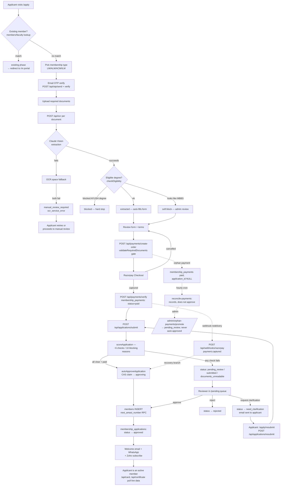

# AMASI Membership — Full Workflow (Intake → Acceptance)

**Method:** every claim below was traced against the live repo at
`/Users/prabhubalasubramaniam/pCloud Drive/CON /amasi-membership` (branch `main`, `apply/page.tsx` currently
**4,068 LOC** — CONTEXT.md's "2,985 LOC" figure is stale, ~36% undocumented growth) and against the live
Supabase project `jmdwxymbgxwdsmcwbahp` (shared "Faculty Management" project), queried directly via the
Supabase MCP tools on 2026-08-20. Where a claim could not be pinned to a specific file:line in this pass, it
is marked **"unverified — follow up"** rather than asserted. Where code and DB disagree, both are stated
side by side — nothing is silently reconciled.

This is a point-in-time trace. Re-verify before relying on any file:line citation in future work — the
codebase already drifted once from a prior version of `.claude/CONTEXT.md` (see §10, "Documentation drift
found").

---

## 0. Table inventory (ground truth, live query)

| Table | Rows (live) | RLS | Purpose |
|---|---|---|---|
| `membership_applications` | 605 approved / 3 rejected / 2 need_clarification (610 total) | enabled, **zero policies** — service-role only via `createAdminClient()` | The application record |
| `draft_applications` | 201 stuck / 185 expired / 60 completed (446 total) | enabled, zero policies | In-progress, pre-submit application state, keyed by email (unique) |
| `membership_documents` | 0 rows | enabled, zero policies | Schema exists; **no code path in this trace writes to it** (see §2, §10 gap) |
| `membership_payments` | 598, all `status='paid'` | enabled, zero policies | One row per captured Razorpay payment. `gateway_payment_id` has a **unique constraint** (`membership_payments_gateway_payment_id_uniq`) — this is the real idempotency backstop for webhook/verify races |
| `members` | 18,725 active / 1 deceased | enabled, policies present (`members_select_admin_team_or_self`) | The onboarded-member record. PK is `email` (text), not a surrogate id |
| `ai_decisions` | 546 (325 manual_review / 213 auto_approved / 8 documents_unreadable) | enabled, 2 policies (admin read, service-role all) | One row per AI scoring event — **1:N per application** (every rescore/resubmit logs a fresh row, never updates one) |
| `membership_audit_log` | 13,134 | enabled | Entity-centric audit log. Auto-populated by a DB trigger (`log_membership_changes()`) on `membership_applications` and `membership_payments` **only** — **no trigger exists on `members`** |
| `admin_audit_log` | 750 | enabled | Actor-centric audit log ("which admin did what"), written explicitly by route handlers via `logAdminAction()` |
| `admin_users` | 3, all `role='admin'` | — | Reviewer/admin accounts. `role` is free text, no DB CHECK constraint |
| `nmc_verification_cache` | 0 | — | 30-day TTL cache for the live NMC Indian Medical Register API, with stale-cache fallback |
| `payment_alerts` | 141, `alert_type IN ('orphan_webhook','orphan_payment','paid_pending_reconciled')` | — | **Not written or read anywhere in this repo** (`grep -rln "payment_alerts"` returns zero hits). Has an `event_id` column, which is meaningless for membership applications — almost certainly belongs to the sibling `amasi-faculty-management` repo sharing this Supabase project. Out of scope, not dead. |

No Postgres trigger drives any part of this workflow beyond timestamp bookkeeping (`update_updated_at()`) and
audit logging (`log_membership_changes()`). **Every status transition, every scoring decision, and every
notification originates from explicit application code** — confirmed by `information_schema.routines` (only
`next_amasi_number()` and `log_membership_changes()` exist as functions) and `information_schema.triggers`
(no trigger touches `ai_decisions` or `members`).

```sql
-- next_amasi_number(): the only sequence-backed allocator in the system
CREATE OR REPLACE FUNCTION public.next_amasi_number() RETURNS bigint
LANGUAGE sql AS $function$ SELECT nextval('amasi_number_seq'); $function$
```

---

## 1. Application Intake

**Actors:** applicant (browser), system (route handlers), OTP-verified session.

### 1.1 Entry routes

| Route | File | Purpose |
|---|---|---|
| `/apply` | `src/app/apply/page.tsx` (4,068 LOC) + `apply/layout.tsx` | Primary orchestrator: new application, resume-by-localStorage, resume-by-emailed-token, existing-member check |
| `/apply/status` | `src/app/apply/status/page.tsx` (873 LOC) | Public read-only status tracker by reference/email/mobile |
| `/apply/resubmit` | `src/app/apply/resubmit/page.tsx` (998 LOC) | Self-contained resubmission flow for `need_clarification`/`resubmit_requested` applications |

`/login` and `/member` are **not** intake routes (staff login and post-approval member portal respectively).

### 1.2 The `apply/page.tsx` phase state machine

`type Phase = "check" | "existing" | "landing" | "verify" | "upload" | "review" | "confirm" | "success"`
(`apply/page.tsx:183`), held in plain `useState` (not `useReducer` — the CONTEXT.md-documented future
refactor still hasn't happened).

```
check ──(member found)──────────────────────────► existing
  │
  └─(no match)──► landing ──(type picked)──► verify ──(OTP ok)──► upload ──(docs ok)──► review
                                                                                            │
                                                                        ┌───────────────────┤
                                                                  (Razorpay opens)     (cancelled)
                                                                        ▼                   │
                                                                    confirm                  │
                                                                        │                    ▼
                                                                  (submit ok)            back to review
                                                                        ▼
                                                                    success
```

Cross-cutting ejector: **any** `save-draft` call from `upload`/`verify`/`review` that gets a
`409 {code:"EXISTING_MEMBER"}` response force-transitions to `existing` (`apply/page.tsx:739-756`) —
this is a real async exit from the middle of the linear flow, not just from `check`.

Key transition sites (file:line, from the intake research pass):

- `handleCheckMembership` no-match branch → `landing` (`:1839`) — deliberately **not** `verify`; inline
  comment: *"Previously this jumped straight to verify, bypassing type selection and creating zombie drafts
  with membership_type: null."* This is the structural fix for the historical `8855294` bug.
- Type-card click → `verify` or `upload` depending on `emailVerified` (`:2122-2125`) — `selectedType` is
  always set synchronously in the same handler, so the null-type bounce cannot originate here.
- OTP-verify success, `!selectedType` guard (`:2264-2271`) — `console.error(...)` + toast + delayed
  `setPhase("landing")`. This is the compliant "crash loudly, not silently" pattern AGENTS.md prescribes.
- OTP-verify success, normal path (`:2278`) — **awaits** `enqueueDraftSave(2, {email_verified:true})`
  before the phase change, closing the historical `58f2891`-class race.
- **Residual bug, `verify` phase "Start Fresh" button (`:2513`): `setPhase(selectedType ? "upload" : "landing")`** —
  the exact ternary shape of the original `8855294` bug, still present verbatim, **with no
  `console.error`/Sentry call on the null branch**. Lower severity than the original (routes to `landing`,
  not `verify`, so it can't loop) but it's the one place the "validate + log loudly" fix was never applied.
- Submit success (Razorpay `handler` callback, after a 3-attempt-retry `POST /api/applications/submit`) → `success`
  (`:1676`). Razorpay `modal.ondismiss` → back to `review` (`:1735`).
- **Final catch-all (`:4065-4067`): `setPhase("check"); return null` — zero logging.** This is the
  single clearest violation of AGENTS.md's own "crash loudly, not redirect silently" rule — ironic, since
  that rule's own postmortem cites this exact file as the cautionary example.

### 1.3 Form fields, membership categories, and the BAMS/BHMS eligibility rule

Canonical shape: `ApplicationFormData` (`src/lib/membership-types.ts:175-233`) — identity, address (with
`zone` auto-derived from `state` via `STATE_TO_ZONE`, sourced from AMASI By-Laws 2023), UG/PG/superspecialty
education, MCI/ASI/international-license registration numbers, clinic/mailing address, international-org
flags, experience entries, and the documents map.

**Four membership types** (`membership-types.ts:40-120`):

| id | name | base fee | required docs |
|---|---|---|---|
| `LM` | Life Member | ₹4,130 | mci_certificate, pg_degree_certificate, asi_member_certificate, profile |
| `ALM` | Associate Life Member | ₹4,130 | mci_certificate, pg_degree_certificate, profile |
| `ACM` | Associate Candidate Member | ₹4,130 | mci_certificate, mbbs_degree_certificate, letter_hod, profile |
| `ILM` | International Life Member | $300 | active_license, pg_degree_certificate, profile |

Processing fee: ₹100 for LM/ALM/ACM, **₹0 for ILM** (INR-only fee). Server-side combined total
(`payments/create-order/route.ts:122-127`) is `MEMBERSHIP_FEES = {LM:4230, ALM:4230, ACM:4230, ILM:300 USD}`
— **not a drift from `membership-types.ts`'s ₹4,130**: 4230 = 4130 base + 100 processing, one file holds the
base, the other the combined total charged. Client-supplied amount/currency are hard-rejected on mismatch
(`create-order/route.ts:143-155`).

**Eligibility rule is document-driven, not a static form rule.** There is no static "MBBS-only" gate on the
membership-type picker. Enforcement lives entirely in `src/lib/document-extraction.ts:45-56` (denylist) and
`:495-522` (`checkEligibility()`), triggered only when a `pg_degree_certificate` is OCR-extracted:

```
BLOCKED_DEGREES  = [bams, bums, bhms, bds, bpt, bot, md ayurveda, md homeopathy, md unani,
                     ms ayurveda, ms homeopathy]                       → hard block
SURGICAL_DEGREES = [ms, m.s, mch, m.ch, dnb surgery/surgical/general surgery/orthopaedics/
                     ent/ophthalmology/obstetrics/gynaecology, frcs, mrcs]  → pass
degree normalizes to exactly "mbbs"                                     → soft block (probable misread,
                                                                            applicant can "Request Admin Review")
```

The literal string "AYUSH" appears nowhere in the codebase — each AYUSH-family degree is enumerated
individually. A UI-only `PG_DEGREES` dropdown (`src/components/profile/education-section.tsx:20-30`) mirrors
this intent but enforces nothing server-side.

### 1.4 Draft vs. submit routes

All are public per `src/middleware.ts:95-155` (`PUBLIC_API_ROUTES`), but most enforce their own
per-caller auth (`verifyMemberSession`, OTP-within-2h, etc.) — public-at-the-middleware-layer,
private-in-the-handler.

| Route | Status written | Trigger | Notes |
|---|---|---|---|
| `PUT /api/applications/save-draft` | `"in_progress"` (insert) | applicant, every autosave | Optimistic-lock loop (3 attempts) on `updated_at`; 409 `EXISTING_MEMBER` short-circuit; 409 `CONFLICT` on lock exhaustion |
| `POST /api/applications/create-pending` | `"pending_payment"` | applicant, WS-C-flagged flow only | Gated behind `WSC_EARLY_APPLICATION_ENABLED`; 404s entirely when off. Requires OTP verified within 2h |
| `POST /api/applications/submit` | one of `ai_approved`/`pending_review`/`submitted`/`documents_unreadable` (fresh insert or `pending_payment →` transition) | applicant, post-payment | `maxDuration=60`. Requires a `membership_payments` row with `status="paid"` matching `paymentId`, plus OTP within 2h, plus `validateRequiredDocuments()` |
| `POST /api/applications/check-duplicate` | none | applicant, pre-payment | Delegates to `checkDuplicateApplication()` (§1.5) |
| `POST /api/applications/draft/resume-from-token` | `"in_progress"` (unpark, any prior status) | applicant, emailed resume link | **No top-level try/catch** — an uncaught throw surfaces as a raw framework 500, not a controlled JSON error. The unpark write's result is **discarded**, no error check |
| `POST /api/otp/send` | `"in_progress"` (insert, only if `membershipType` present) | applicant | Server-side `MEMBERSHIP_TYPE_REQUIRED` gate (`:51-85`) rejects OTP-send for genuinely untyped callers — stricter than the historical fix. Draft create/update block is `if (membershipType) {...} catch {}` — **swallowed, zero logging on failure** |
| `POST /api/otp/verify` | (no `membership_applications`/`draft.status` write; syncs `step_data.email_verified` directly) | applicant | **Correction to CONTEXT.md**: the "legacy member OTP login" fallback (`24547fc`) does **not** live here — this file has no reference to `members` at all. It lives entirely in `otp/send`'s `MEMBERSHIP_TYPE_REQUIRED` bypass |
| `POST /api/applications/resubmit` | `{need_clarification\|resubmit_requested} → "submitted"` | applicant, only after a reviewer flags the app | Ownership check (email match), status gate, OTP-within-2h gate. Re-scoring block is fully swallowed — a re-scoring failure never blocks the already-applied `"submitted"` status |

### 1.5 Duplicate detection

`checkDuplicateApplication()` (`src/lib/application-utils.ts:46-224`), called from `check-duplicate/route.ts`
and implicitly from `save-draft`:
1. `membership_applications` by email and by phone (two separate `.eq()` calls, not `.or()` — deliberately
   avoids PostgREST filter-injection). Blocks on status ∈ `{pending, pending_payment, submitted, under_review,
   pending_review, ai_approved}`.
2. MCI/council registration-number match (state-aware) against `membership_applications` (excluding rejected).
3. Same registration-number check against `members`.
4. `members` by email (ilike) and phone (exact).

`draft_applications` is **not** queried by this helper — only the separate `EXISTING_MEMBER` 409 inside
`save-draft` covers drafts.

---

## 2. Document Upload + AI OCR Pipeline

**Actors:** applicant (upload), system (Claude Vision / OCR.space, Supabase Storage).

### 2.1 `POST /api/ocr` (`src/app/api/ocr/route.ts`, 341 lines, `maxDuration=60`)

In-file contract (`:21-43`): **always** durably store the file before evaluating AI outcome, except on
input-validation failure. `maxDuration=60` was bumped from Vercel's 15s default after a 2026-05-18 incident
where Claude Vision + OCR.space fallback exceeded it and the browser saw a bare "Connection problem" with no
Sentry signal.

Order of checks: rate limit (10/15min/IP, `:47-56`) → `getMemberSession()` auth (`:58-85`, Sentry
`ocr_auth_rejected` on failure) → missing file/docType (`:87-98`) → file size >5MB (`:100-108`) → magic-byte
format check (JPEG/PNG/PDF only, `:112-123`).

**Storage-before-classify** (`:129-199`): uploads to Supabase Storage bucket **`uploads`** as
`${folder}/${Date.now()}-${random6}.${ext}`, where `folder = requiresExtraction(docType) ? docType : "photo"`.
`fileUrl` returned to the client is a **storage object path, not a public URL** (bucket is Phase-B slated to
go private). Storage failure is a hard fail (`:150-191`) — Sentry exception, best-effort draft tagging
(`failure_reason:"system_upload_failed_no_fileurl"`), returns `outcome:"rejected", reason:"ocr_service_error"`.

Full outcome/reason matrix:

| outcome | reason | fileUrl? | HTTP |
|---|---|---|---|
| rejected | rate_limit / auth / missing_input / file_too_large / invalid_format | no | 429/401/400/400/400 |
| rejected | ocr_service_error (storage failed, or top-level catch) | no / maybe | 500 |
| stored | — (profile photo, extraction skipped) | yes | 200 |
| manual_review_required | ocr_below_threshold / ocr_service_error | yes | 200 |
| extracted | — | yes | 200 |

**`membership_documents` is never written by this pipeline.** All four files in scope
(`ocr/route.ts`, `document-extraction.ts`, `document-keys.ts`, `persist-ocr-upload.ts`) write only to
Supabase Storage and `draft_applications.step_data.uploads`. Neither this research pass nor any of the six
agents traced a write to `membership_documents` anywhere in the submit/approve paths either — **this is an
open question, not a confirmed dead table**: it may be populated by code outside the six traced areas, or it
may genuinely be unused. Flagged in §10 as a follow-up, not asserted as fact.

### 2.2 Extraction engine (`src/lib/document-extraction.ts`)

- **Model:** `claude-sonnet-4-6` (`:657`), `new Anthropic({apiKey, timeout:25_000, maxRetries:0})` (`:639`) —
  25s timeout, zero retries, confirmed exact.
- **Preprocessing** (`preprocessImage`, `:99-132`, skipped for PDFs): EXIF-rotate, resize to max 3000px,
  normalize + sharpen + denoise, re-encode PNG q95. Failure falls back to the original buffer unchanged.
- **Prompt injection guard**: every prompt is prefixed with `UNTRUSTED_CONTENT_RULE` (`:153-167`) —
  instructs the model to treat all in-image text as content to transcribe, never as instructions, and to
  flag `extraction_confidence:"low"` on injection-like text.
- **Six document-type prompts** (`buildPrompt`, `:169-316`): `mci_certificate`, `pg_degree_certificate`
  (with an explicit degree-normalization table: "Master of Surgery"/"M.S."/"MS" → `M.S.`; explicit
  instruction not to return MBBS for an MD/MS/MCh/DNB cert), `mbbs_degree_certificate`,
  `asi_member_certificate` (the one prompt **without** the shared `REJECT_INSTRUCTIONS` block — a minor
  inconsistency), `letter_hod`, `active_license`. Unknown `docType` → empty prompt → treated as
  misconfiguration (`isValid:false, engineError:false`), not a service error.
- **Failover to OCR.space**: any Claude exception, missing `ANTHROPIC_API_KEY`, or unparseable JSON response
  falls through (`:676-678`, `console.error` logged) to `fallbackOCR()` (`:322-427`) — regex-based field
  extraction, weaker than Claude's structured JSON, 20s timeout (`AbortSignal.timeout(20_000)`), requires
  ≥2 medical keyword matches or returns `is_valid_medical_document:false`. Downstream consumers accept
  **both** key shapes (`extracted.degree_name || extracted.degree`, etc.) rather than remapping.
- **Both engines fail** (`:682-701`): `isValid:false, engine:"tesseract", engineError:true`.
- **Second-opinion sanity check** (`detectSuspiciousExtraction`, `:433-489`): rejects on financial-keyword or
  ID-document-keyword matches, missing degree/college/university for PG/MBBS certs, missing
  registration_number+name for MCI certs — independent of what either engine claims.
- **Never throws** — function is explicitly documented to always return a structured result (`:594`).

### 2.3 `src/lib/document-keys.ts` — canonical registry

7 canonical keys (`mci_certificate`, `pg_degree_certificate` [alias `pg_certificate`],
`mbbs_degree_certificate`, `asi_member_certificate` [alias `asi_certificate`], `letter_hod` [alias
`hod_letter`], `active_license`, `photo` [aliases `profile`, `profile_photo`, `applicant_photo`]).
`normalizeDocumentKey()` resolves alias→canonical, unknown keys pass through lowercased.
`requiresExtraction()` defaults unknown types to `true` ("safer"). `MANUAL_REVIEW_REASON_CODES` =
`["ocr_below_threshold", "ocr_service_error", "user_bypass", "face_detection_failed"]` — **`user_bypass` is
never actually emitted anywhere in the OCR pipeline** (only the other three are produced by the code traced
in this pass).

**`validateRequiredDocuments(uploads, requiredDocTypes)`** (`:226-265`) is the single authoritative
server-side gate, explicitly shared by **three call sites**
(`payments/create-order/route.ts`, `applications/submit/route.ts`, `ai-approval.ts` — the in-code comment
warns "if you add a fourth, route it through here too," after one prior drift incident, commit `d3e4011`).
Per-doc rule: `"extracted"` passes; `"uploaded"` passes only with `bypass===true` and a valid
`bypassReason`; anything else (including plain `"uploaded"` with no bypass marker) → `missing`. `photo` is
explicitly **skipped** by this loop — required in the UI, not enforced server-side by this gate.

### 2.4 Client-side upload state machine (`apply/page.tsx`)

`UploadEntry.status ∈ {"processing","extracted","uploaded","rejected","blocked"}`. Two **deliberately
separate** validity helpers exist (`isRequiredSlotValid` vs `isProfileSlotValid`, `:209-259`) with an explicit
"DO NOT MERGE" comment — profile photos never reach `"extracted"`, so a unified rule would falsely reject the
happy path.

Failure/message matrix (client-facing):

| Server outcome/reason | Card shown | Message |
|---|---|---|
| rejected/file_too_large | — | "This file is too large. Try a clearer phone photo or compress the image first." |
| rejected/invalid_format | — | "This format isn't supported. Please upload a JPG, PNG, HEIC, or PDF." |
| rejected/rate_limit | — | "Too many uploads. Please wait a few minutes and try again." |
| rejected/auth | "Session Expired" | "Your session expired. Please refresh and verify your email again." |
| rejected/ocr_service_error | — | "We couldn't save your document. Please try again in a moment." |
| manual_review_required | "Document Not Recognized" | AI's specific `rejectionReason`, CTA "Retry with a clearer photo" |
| extracted, eligibility hard-blocked | "Not Eligible" | `eligibility.reason` (blocked-degree message) |
| extracted, eligibility soft-blocked (MBBS misread) | stays green | toast "Document received — under review" |
| network TypeError (fetch failed, no server response) | — | "Connection problem. Please try again in a moment." |
| client abort/timeout (60s) | — | "Upload took too long. Please check your connection and try again." |

Two real drifts surfaced by this pass:
- A comment at `apply/page.tsx:1046-1051` claims the manual-review-bypass entry was already persisted to the
  draft server-side by `persistOcrUploadToDraft` — but `ocr/route.ts`'s `manual_review_required` branch
  (`:251-279`) does **not** call `persistOcrUploadToDraft` (only the `stored` and `extracted` branches do,
  `:217`, `:303`). Persistence for that entry relies entirely on the client's own later `save-draft` call.
- The profile-photo `face_detection_failed` bypass sets `bypass`/`bypassReason` only in client React state.
  The server's `"stored"` outcome branch (`ocr/route.ts:217-226`) hardcodes the draft write as
  `{status:"uploaded", fileUrl, extracted:{}}` with **no bypass fields**, regardless of whether the upload
  came from the happy path or the bypass path — the server can't distinguish the two, since both hit
  `docType:"profile"` identically.

`persistOcrUploadToDraft()` (`src/lib/persist-ocr-upload.ts`) uses an optimistic lock on `draft.updated_at`
(1 retry), writes into `draft_applications.step_data.uploads.<rawClientKey>` (deliberately the **raw**,
un-normalized key — `apply/page.tsx` hardcodes `"profile"` client-side; writing under normalized `"photo"`
would create a duplicate JSONB entry), and is designed to never throw.

---

## 3. Auto-Approval

**Actors:** system (scoring engine + write helper), triggered by submission or webhook recovery.

### 3.1 The scoring engine — `src/lib/ai-approval.ts` (`scoreApplication`)

The code's own comment at `:582` calls this a **"strict 4-check rule."** Reading the actual logic
(`:582-655`), the true shape is **~6 underlying checks producing 10 distinct blocking-reason codes**,
gating on a pass/fail list, not a score threshold — **the "4-check" framing in the code comment is itself
stale and should not be repeated verbatim in future documentation.**

| # | Blocking reason | Condition | file:line |
|---|---|---|---|
| 1 | `name_similarity_below_80` | Name-consistency score < 80 | `:594-597` |
| 2 | `college_match_below_85` | College/university match score < 85 | `:599-602` |
| 3 | `degree_check_failed` | PG degree check failed, or score < 80 | `:604-607` |
| 4 | `mci_mismatch` | MCI/council registration score < 95 (skipped — weight 0 — for ILM) | `:609-612` |
| 5 | `missing_required_documents` | Document AI-verification score < 100 | `:614-617` |
| 6 | `blocked_degree` | PG degree matches `BLOCKED_DEGREES` | `:19-23, 620-622` |
| 7 | `nmc_name_mismatch` | NMC-returned name similarity < 0.5 (NMC being *down* does NOT block — see §3.2) | `:624-627` |
| 8 | `payment_pending` | `paymentPaid === false` | `:630-632` |
| 9 | `manual_review_bypass` | any required doc used the user manual-review-bypass path | `:636-641` |
| 10 | `low_extraction_confidence` | any of pg/mbbs/mci docs has `extraction_confidence:"low"` | `:33-37, 108-131, 643-653` |

`autoApprove = paymentPaid && blockingReasons.length === 0` (`:655`). A separate weighted `totalScore`
(0–100; weights name 20 / degree 25 / college 15 / MCI 15 / doc-AI 10 / NMC 20, renormalized when NMC/MCI
weight drops to 0 for ILM) is computed at `:578-580` but, per the code's own comment (`:582-584`), is
**display-only and does not gate auto-approval** — only the blocking-reasons list does.

**Pre-flight gate** (`:214-290`): before any of the 10 checks run, every required doc must have a
`fileUrl` and be either `"extracted"` or validly bypassed. Failure short-circuits to
`decision:"documents_unreadable", totalScore:0, checks:[]` — skipping per-check scoring entirely.

### 3.2 NMC verification (`src/lib/nmc-cache.ts`)

Live call to `https://www.nmc.org.in/MCIRest/open/getDataFromService?service=searchDoctor`
(`callNmcOnce`, `:29-38`), invoked from `ai-approval.ts:496`. Retry chain: 2 attempts (5s then 3s timeout,
2s backoff) → on success, cache write with 30-day TTL (`CACHE_TTL_DAYS=13`) → on failure with an existing
cache row (even expired), serve **stale cache** (`source:"stale_cache_hit"`, flagged but non-blocking) → on
failure with no cache at all, `reachable:false`, **treated as pass-through** (`nmcWeight=0, nmcPassed=true`,
flag `"NMC service unreachable — verification skipped; admin to re-verify manually"`). ILM applicants skip
NMC entirely (`nmcWeight=0, nmcApiStatus:"skipped_ilm"`). **Confirmed: NMC being down never blocks
auto-approval — only a live NMC response with a mismatched name does (`nmc_name_mismatch`).**

### 3.3 PASS path — `src/lib/auto-approval.ts` (`autoApproveApplication`)

`scoreApplication` never writes to the DB itself (aside from the NMC cache). All writes happen in this
separate helper, called only when `allAiVerified` (from `submit/route.ts:207,480`) or by the webhook
recovery branch (`webhooks/razorpay/route.ts:223`):

1. **Idempotency read** (`:134-161`): honors a pre-assigned `assigned_amasi_number` if `status !== "approved"`.
2. **Retry short-circuit** (`:163-214`): already `approved` → return as-is; a `members` row already exists
   for the email (partial prior run) → link it, no new sequence number burned.
3. **Atomic claim (CAS)** (`:236-241`): `UPDATE membership_applications SET status='approving' WHERE id=...
   AND status IN ('submitted','pending_review','ai_approved')`. Zero rows updated → another worker owns it,
   still returns `success:true` (so Razorpay stops retrying the webhook).
4. **Reserve AMASI number** (`:300-318`): pre-assigned, or `supabase.rpc("next_amasi_number")`.
5. **Insert `members` row** (`:326-377`): `status: "active"`, `voting_eligible: membershipType === "LM"`,
   full profile/education/doc-URL copy.
6. **Update `membership_applications`** (`:391-404`): `status → "approved"`, `assigned_amasi_number`,
   `member_id`, `needs_manual_review:false`. **Failure here is treated as soft** — the function still
   returns `success:true` since a real member already exists (see §9 gap).
7. **`ai_decisions` outcome update** (`:419-422`): `final_status:"approved", final_status_by:"ai"`.
8. **Notifications, all best-effort/non-blocking** (`:429-492`): Resend welcome email, WhatsApp (if phone),
   Zoho Campaigns subscribe.

On claim/sequence/member-insert failure, `revertClaim()` (`:283-298`) resets status to `priorStatus` for a
clean retry.

### 3.4 FAIL path

`submit/route.ts:213-215` computes `applicationStatus`:
`documentsUnreadable ? "documents_unreadable" : hasPendingReview ? "pending_review" : "submitted"`.
`manual_review_reason` is a structured `"<code>: <detail>"` string (codes: `user_bypass`,
`ocr_below_threshold`). `ai_decisions.decision` (`src/lib/ai-decision-log.ts:69-87`):
`scoringError → "manual_review"`, `documents_unreadable → "documents_unreadable"`,
`autoApprove → "auto_approved"`, else `"manual_review"`; `blocking_reason` is the joined blocking-reasons
string.

**Reviewer notification**: `notifyAdminsNewApplication()` fires unconditionally for **every** submission
(auto-approved or not) to every active `admin_users` row + `ADMIN_DEFAULT_EMAIL` — there is no
manual-review-only alert distinct from this.

### 3.5 `approve/route.ts` is NOT a wrapper around `autoApproveApplication`

It is a **fully separate, duplicated implementation** — reimplements the same member-row construction
inline (`approve/route.ts:155-228`), confirmed as the fragile area CONTEXT.md already flags (though the note
that "three handlers" build the row is now stale — see §10). Key behavioral differences:

- Requires an active admin session (`getAdminSession()`), triggered by a human clicking Approve.
- Idempotency guard is `app.member_id` presence, not the CAS/claim pattern.
- **On a post-insert application-update failure, it actively rolls back** — deletes the just-created
  `members` row (`:256-265`). `auto-approval.ts` explicitly does the opposite (never rolls back a real
  member). **This is a real inconsistency in failure semantics between the two approval paths.**
- Document-completeness gate is skippable via `force=true` or when `member_id` is already set;
  `auto-approval.ts` has no equivalent gate at all (trusts the caller already validated via
  `scoreApplication`'s pre-flight gate).

Both honor `assigned_amasi_number` identically (`approve/route.ts:138-141` mirrors `auto-approval.ts:147-152`
in intent) — the CONTEXT.md claim on this specific point is still accurate.

### 3.6 The `clarification_requested` / `need_clarification` naming drift — confirmed

Same admin action, two different literal strings, no shared constant:
- `membership_applications.status` gets `"need_clarification"` (`applications/clarification/route.ts:73,78`).
- `ai_decisions.final_status` gets the **different** string `"clarification_requested"`
  (`clarification/route.ts:150-154`).

This is a genuine, undocumented naming drift between two tables representing the same admin decision — not a
bug in the sense of broken behavior (nothing currently reads `ai_decisions.final_status` expecting it to
match `membership_applications.status` verbatim), but a trap for future code. One consumer,
`src/app/api/get_member_activity/route.ts:29`, has a `case "clarification_requested":` branch whose source
table was not conclusively traced in this pass — **flagged as unverified, follow up before relying on it.**

### 3.7 Race conditions / idempotency

- The CAS claim (`status='approving'`) is the documented fix for the historical AMASI-number-gap incident
  (18260-61, 18278-81) — closes the common webhook-retry / client-verify double-invocation race.
- **Remaining gap**: there is **no top-level `try/finally`** around the claim→insert→update sequence.
  An uncaught exception after the CAS succeeds but before `revertClaim()`/the final update runs leaves the
  row permanently at `status='approving'` with the sequence number possibly burned. `"approving"` is
  filtered out of every admin queue (`applications/list/route.ts` doesn't include it in any tab) and no
  cron reads or resets it — **a stuck row is invisible everywhere.** Zero rows currently sit at this status
  in prod (theoretical, not active, gap).
- `webhooks/razorpay/route.ts` adds a **third** independent write path to `status="approved"` (a
  "force-relink" defense-in-depth check, `:262-310`, for the case where `autoApproveApplication` returned
  `success:true` but its own application-row update silently failed) — this increases the surface for the
  two-handler member-row-construction drift (§3.5) without adding its own independent safety guard; it
  relies entirely on `auto-approval.ts`'s CAS machinery.

---

## 4. Manual Review

**Actors:** reviewer/admin (`admin_users`), system.

### 4.1 Roles

Two login paths (`api/auth/login/route.ts`): env-var bypass (`ADMIN_DEFAULT_EMAIL`/`PASSWORD` →
`adminRole:"super_admin", permissions:["all"]`) and DB admin (bcrypt via RPC `verify_admin_password`, TOTP
2FA if `admin_users.totp_secret` set). `admin_users.role` is free text (no DB CHECK); app-level validation
only enforces `["super_admin","admin","reviewer"]` in the user-management route. **Prod: all 3 admin_users
rows are `role='admin'`** — nobody is currently `reviewer` or DB `super_admin`.

**Role granularity is close to theoretical**: `adminRole !== "super_admin"` is checked in exactly one
place — `api/admin/users/route.ts` (manage other admins). Every application-review action (approve, reject,
clarify, refund, rescore, edit-fields) only requires a valid admin session, **not** a specific role — a
hypothetical `reviewer` account would have identical power to `super_admin` over applications.
`admin_users.permissions` is dead: the column doesn't exist in the schema, the RPC never returns it, code
always falls back to `["all"]`.

### 4.2 The `/pending` review queue

`GET /api/applications/list?status=&limit=100` (`applications/list/route.ts:8-56`). Status→filter mapping:
`pending → status IN (submitted, pending_review)`, `ai_approved → status = ai_approved`,
`approved/rejected → exact match`, `clarification → status IN (need_clarification, resubmit_requested,
documents_unreadable)`. **Pagination gap**: the API supports `offset`/`limit` and returns an exact `total`,
but `/pending` hardcodes `limit=100` with **no offset control and no "load more"** — only a footnote count.
Any tab exceeding 100 rows silently truncates in the UI, the same class of bug as the previously-fixed
`951febb` `/admin/fmas` 1000-row cap, **unpatched here.**

Every GET on this route also runs `autoHealBuggyScores()` (`:69-131`) — a side effect that silently
re-scores and updates rows matching a historical scoring-bug signature, on every list fetch.

### 4.3 Reviewer actions

| Action | Route | Status transition | Emails | Audit |
|---|---|---|---|---|
| Approve | `POST /api/applications/approve` | `{submitted\|pending_review\|ai_approved\|documents_unreadable} → approved` | Welcome (Resend), WhatsApp, Zoho subscribe — all swallowed on failure | `admin_audit_log` (`approve_application`, coarse: amasiNumber+type only) + auto DB-trigger row diff on `membership_applications` — **`members` row itself has no audit trail at all** |
| Reject | `POST /api/applications/reject` | anything except `approved`/`ai_approved` → `rejected` | Rejection email quoting the reason verbatim | `admin_audit_log` (`reject_application`, reason) + auto trigger diff |
| Request clarification | `POST /api/applications/clarification`, `action:"need_clarification"` | anything except `approved`/`ai_approved`/`rejected` → `need_clarification` | Email quoting reviewer message + resubmit link | `admin_audit_log` (`request_clarification`) + auto trigger diff. `ai_decisions.final_status → "clarification_requested"` (see §3.6 drift) |
| Request resubmit | same route, `action:"ask_resubmit"` | → `resubmit_requested` | Same as above | `admin_audit_log` (`request_resubmit`) |
| **Internal note** | same route, `action:"internal_note"` | none | none | **The write always fails** — see §4.4 |
| Rescore | `POST /api/applications/rescore` | none (updates `ai_confidence`/`ai_verified`/`needs_manual_review`/`ai_flags`) | none | `admin_audit_log` (`applications.rescore`, per-row before/after confidence) |
| Edit fields | `PATCH /api/applications/[id]/edit-fields` | none (blocked once status is final) | none | `admin_audit_log` (`edit_application_fields`, structured field diff) + auto trigger diff |
| Refund | `POST /api/applications/refund` | `draft_applications`: `payment_on_hold → refund_initiated`; `membership_payments.status → refund_initiated` only if a matching row exists | Refund-notice email | `membership_audit_log` directly (via `logMembershipAuditEvent`, **not** `admin_audit_log`) — `refund_initiated`/`refund_failed` |

**`reviewed_by` (uuid column) is never written by approve, reject, or clarification** — despite existing
specifically for this. The only durable record of *which admin* acted is `admin_audit_log.admin_email`
(free text, not an FK). If that log were ever pruned, "who approved application X" would be unanswerable
from `membership_applications` alone.

### 4.4 `internal_notes` — a broken feature

`clarification/route.ts`'s `internal_note` action reads/writes `app.internal_notes` —
**this column does not exist on `membership_applications`.** The real note-shaped columns are `admin_notes`
(jsonb, `NOT NULL DEFAULT '[]'`, **zero references anywhere in the codebase — dead**) and `review_notes`
(text, used for the applicant-visible reviewer message on approve/reject/clarify). Every "Add internal note"
click therefore fails with a 500 ("Failed to save internal note"), and any prior note never renders (the
field is always `undefined` on a `select("*")` row). This has been broken silently — it surfaces as a
visible save failure, but nothing in the codebase or CONTEXT.md flags it as a known issue.

### 4.5 Query/revert-to-applicant round trip

Reviewer requests clarification/resubmit → email with a `/apply/resubmit?ref=...` link → applicant OTP-gates
in, edits/re-uploads (re-running `extractDocument()` per changed doc) → `POST /api/applications/resubmit` →
`status → "submitted"` (review_notes cleared) → **re-enters the `pending` tab of the queue** (since its
filter includes `submitted`) — it does **not** auto-approve and does **not** loop back to
`need_clarification`. There is no cap on clarify↔resubmit round trips and nothing tracks a resubmission
count. The resubmit route has no admin actor, so no `admin_audit_log` entry — only the automatic DB-trigger
diff on `membership_applications` (`performed_by:'system'`).

### 4.6 Audit trail completeness — per action

Every action above except **Internal note** (fails before persisting) and **Refund** (uses
`logMembershipAuditEvent` instead) writes an `admin_audit_log` entry. Every `membership_applications` UPDATE
(all of the above) is automatically captured by the DB trigger into `membership_audit_log` — **except**
mutations to the `members` table itself (approve's member insert/update), which has **no trigger and no
explicit app-level audit call** — the coarse `admin_audit_log` entry (amasiNumber+type only, not a full
row diff) is the only trace.

---

## 5. Payment

**Actors:** applicant (browser + Razorpay checkout), Razorpay (webhook), cron, admin.

### 5.1 `POST /api/payments/create-order` — order creation

Applicant-triggered, before any `membership_applications` row exists. `MEMBERSHIP_FEES` server-side table
(§1.3) rejects client-amount mismatches. Reads `draft_applications.step_data.uploads` (not the request body)
and calls `validateRequiredDocuments()` — refuses to mint an order on incomplete docs, paging Sentry at
`fatal` via `alertIfPaidPathBlockedByLostUploads()` if OCR-extracted docs are missing from the draft.

**Three duplicate/orphan guards, in order** (`:234-337`):
1. `draft_applications.has_verified_payment=true` for the same email+type → 409 `DUPLICATE_PAYMENT`.
2. `membership_applications` already paid and not rejected → 409 `DUPLICATE_PAYMENT`.
3. **A `membership_payments` row with `status='paid'` AND `application_id IS NULL` for this email** → 409
   `PAID_UNLINKED`, Sentry warning, tells the applicant to email support rather than re-pay. This is the
   exact "orphaned paid application" state the schema allows (`application_id` is nullable specifically for
   this reason).

Razorpay order created with Route `transfers` included at creation (processing fee, ₹0 for ILM, to
`EVENTS360_RAZORPAY_ACCOUNT_ID`) — falls back to a transfer-less retry on Route failure. **Nothing is
written to `membership_payments` or `draft_applications` at order-creation time** — only the Razorpay order
id is returned.

### 5.2 `POST /api/payments/verify` — checkout callback

HMAC verification (`order_id|payment_id` signed with `RAZORPAY_KEY_SECRET`) — **plain `!==` string
compare, not constant-time** (unlike the webhook route, which correctly uses `crypto.timingSafeEqual`).
Payment-level fallback Route transfer if the order-level transfer wasn't present. Idempotency: pre-check by
`gateway_payment_id`, but the real guard is the `upsert(..., {onConflict:"gateway_payment_id",
ignoreDuplicates:true})` at insert time, backed by the DB unique constraint.

**Defense-in-depth doc re-check post-payment** (`:164-218`): if the draft's uploads are no longer valid at
verify time, sets `paidButBroken=true`, fires a `fatal` Sentry message, flags the draft `status:"stuck",
failure_reason:"system_payment_verification_failed"` — an explicitly anticipated "money moved, record didn't
advance" case.

**Insert into `membership_payments`** (`:222-258`): `status:"paid"` unconditionally,
`application_id: applicationId || null` — **almost always `null`** in the normal `/apply` flow, since the
application row doesn't exist yet (it's created by `applications/submit`, which backfills it). Insert
failure → `Sentry.captureException` at `fatal`, explicit "Razorpay has the money; our DB doesn't" case.

### 5.3 `POST /api/webhooks/razorpay` — server-to-server

Signature check via `crypto.timingSafeEqual` with a length guard — correctly constant-time.

**`payment.captured`**: idempotency pre-check by `gateway_payment_id` (real backstop is the
`upsert(...ignoreDuplicates:true)` against the unique constraint — "first writer wins, second is a no-op").
Email-resolution fallback chain (`reference_number` match → Razorpay payload email →
`unknown-<id>@razorpay-webhook.invalid`, closing a 2026-05-19 NOT-NULL-violation incident). Payment insert,
then application `payment_status` update (only for rows still `pending`).

**Auto-approve recovery branch** (`:157-325`): if the app is still `status="submitted"` with
`ai_confidence >= 80` (parsed from the stored column, not re-scored), calls `autoApproveApplication()`. The
entire recovery block is wrapped in `try {...} catch { console.error }` — **any exception here is swallowed
and never causes the webhook to return non-2xx**, so Razorpay won't retry. Includes the "force-relink"
defense-in-depth check described in §3.7.

**CONTEXT.md's claim re-verified against current code**: *"the auto-approve branch is NOT idempotent
against partial failure"* is now **partially stale**. The CAS-claim machinery in `auto-approval.ts` (added
since that note was written) closes the common retry-race case; the real remaining gap is narrower — an
uncaught exception strictly between the CAS claim succeeding and the final update/revert (§3.7) — not the
blanket "not idempotent" the note implies.

**`payment.failed`**: only updates `membership_applications.payment_status = "failed"` for a matching
`pending` reference_number. **No `membership_payments` row is ever written for a failed payment** — this is
exactly why every row in prod (598/598) has `status='paid'`: failed attempts never produce a DB row under
either the webhook or verify path.

### 5.4 Reconciliation + orphan-payment recovery

**`GET/POST /api/cron/reconcile-payments`** (hourly, `7 * * * *`): lists Razorpay `payments.all()` for the
lookback window, diffs `status="captured"` payments against `membership_payments.gateway_payment_id` to find
ones Razorpay confirms but the DB never recorded (the true "silent drop" case — missed webhook *and* missed
verify callback). Inserts the missing row via the same email-resolution + upsert logic as the webhook.
**v1 explicitly does not auto-approve** — it only records the payment for admin visibility; auto-approval
from the cron is an acknowledged follow-up, not yet built.

**`/admin/orphan-payments`** (admin read surface) lists `membership_payments` where `application_id IS NULL
AND status='paid'`, cross-referenced against `draft_applications` by email for a recovery hint.

**`POST /api/admin/orphan-payments/promote`** — confirmed as the "self-service recovery" tool referenced in
project memory. Two modes: **draft** (reconstructs a full `membership_applications` row from the payer's
most recent usable draft via `buildApplicationRow()`, scores it, **always routes to `pending_review` —
never auto-approves**) or **skeleton** (no usable draft — inserts a minimal `pending_review` row with
`needs_manual_review:true`). Links the payment via
`UPDATE membership_payments SET application_id=... WHERE id=... AND application_id IS NULL` (race-safe).
Writes `admin_audit_log` (`orphan_payment_promote_to_pending`).

### 5.5 Legacy mobile shim payment — known gap, not re-derived

`src/app/api/final_step/route.ts` cannot do canonical HMAC verification because the Flutter v1.0.4+2 binary
doesn't forward `razorpay_signature`/`razorpay_order_id` as named fields (AGENTS.md documents this in full).
Substitute: server-side `orders.fetch()` + `payments.fetch()` cross-check, ignoring the client's claimed
`payment_status`. This closes the "client lies about success" fraud surface but not a replay of someone
else's real `payment_id` against a different draft — that needs the HMAC binding, which requires a Flutter
release to fix client-side.

### 5.6 Refund

`POST /api/applications/refund` (admin-only) operates on **`draft_applications`**, not
`membership_applications` — specifically the "payment captured, applicant never completed" path. Requires
`draft.status === "payment_on_hold"`. On Razorpay success: `draft_applications.status → "refund_initiated"`;
if that update itself fails, the error message explicitly says "reconcile manually." `membership_payments`
status is updated **only if a matching row already exists** — a refund against a payment reconciliation
hadn't yet caught updates nothing there, tracked only via the draft + `membership_audit_log`.

### 5.7 Every place money can move without the application advancing (as requested)

1. `payments/verify` insert into `membership_payments` fails → Sentry fatal, **no DB row at all** despite
   captured money.
2. `payments/verify`'s post-payment doc re-check fails (`paidButBroken`) → draft flagged `stuck`, but the
   payment row is still written `paid`.
3. `payments/verify`'s optional application-status update (when `applicationId` was passed) fails → Sentry
   error, application stays `payment_status:'pending'`.
4. `webhooks/razorpay` payment insert or application-status update fails → Sentry exception, no further
   retry beyond Razorpay's own webhook redelivery.
5. `webhooks/razorpay`'s auto-approve recovery branch throws after the CAS claim succeeds but before
   `revertClaim`/final update → application permanently at `status='approving'`, invisible to every admin
   queue and every cron (§3.7).
6. `application_id IS NULL` on an otherwise-`paid` row — the general orphan-payment state — caught hourly by
   reconciliation (records, does not approve) and surfaced for manual/self-service recovery via
   `/admin/orphan-payments`.
7. Refund succeeds at Razorpay but the draft-status update or `membership_payments` status update fails —
   surfaced as an explicit "reconcile manually" message, or silently untracked in `membership_payments` if
   no row existed there to begin with.

---

## 6. Acceptance

**Actors:** system (auto-approval), reviewer (manual approval).

### 6.1 Status-flip call sites

Four places write `status: "approved"`, collapsing into one shared helper plus one independent admin
handler:

| # | file:line | Actor |
|---|---|---|
| A | `applications/approve/route.ts:240` | Reviewer, manual click |
| B | `auto-approval.ts:394` (happy path) | System, via `autoApproveApplication` |
| C | `auto-approval.ts:189` (recovery-link — a `members` row already exists but the app row never updated) | System |
| D | `webhooks/razorpay/route.ts:289` (direct update, **not** via the helper — force-relink defense-in-depth) | System |

B/C are invoked from three call sites: `applications/submit/route.ts:483` (fresh auto-approve),
`webhooks/razorpay/route.ts:223` (recovery), and a one-shot backfill script
`scripts/approve-legacy-pending-2026-05-04.ts`.

### 6.2 Member record creation — corrected fragile-area note

`lib/build-member-row.ts` (the long-term unification CONTEXT.md calls for) **still does not exist**.
**There are two independent member-row-construction blocks, not three** —
`applications/submit/route.ts` delegates entirely to `autoApproveApplication()` rather than building its own
row, so the real count is `approve/route.ts:155-228` vs. `auto-approval.ts:326-377`. **This corrects
CONTEXT.md's fragile-area note, which should be updated.**

**Column-copy audit** (comparing live schemas against both insert blocks) — confirms CONTEXT.md's general
warning and finds specific, previously-unflagged gaps:

- `landline`, `std_code` — exist on both tables; neither insert block reads them, and neither is in
  `AutoApprovalInput`'s type at all.
- `other_intl_org`, `other_intl_org_value` — same: dead on both approval paths.
- **Superspecialty**: `members` has `edu_superspecialty_college/university/year` in addition to `_degree`.
  Both paths copy **only** `_degree` (`approve/route.ts:192`, `auto-approval.ts:363`) — the other three are
  silently dropped and aren't even in `AutoApprovalInput`.
- `clinic_name/address/city/state/pin`, `use_clinic_as_mailing` exist only on `membership_applications` —
  **structural** loss on approval, not a copy-omission bug (no matching `members` columns exist at all).
- `intl_org_sages`/`intl_org_elsa` (application-only) have no `members` analog — same structural gap.
- `profile_photo_url` (a dedicated application column) is **never read** — both paths instead derive the
  photo from the `documents` JSON blob. Dead column.

`upgrade_from` and `previous_membership_no` on `membership_applications` are **entirely dead code** —
zero references anywhere in `src/` or `scripts/` (a full-repo grep confirms). In-place tier upgrades
(ALM→LM etc.) are handled by the separate `membership_upgrades` table via `UPDATE members SET
membership_type=...` on an existing member row — an entirely different mechanism from these two columns,
which were never wired up.

### 6.3 AMASI number allocation

Both A and B/C honor `assigned_amasi_number` identically: if set and `status !== "approved"`, use it and
skip the RPC; else `supabase.rpc("next_amasi_number")` (`approve/route.ts:138-152`,
`auto-approval.ts:147-152, 300-318`). This is the documented anti-gap-burn fix and both paths implement it
consistently.

### 6.4 Welcome email / certificate

**No certificate is attached or generated at approval time.** Both handlers send a plain Resend HTML email
(AMASI number + membership type, reference number on the admin path) — no PDF, no certificate link, no
digital-card link in the email body.

`/api/card` and `/api/certificate` are **pull-based, live-query endpoints**, not approval-triggered
generators — both public, rate-limited (20/15min/IP), keyed by `?id=<amasi_number>`, doing a live
`SELECT * FROM members` at request time (so they always reflect current data, with no caching or
pre-generated artifact). `/api/certificate` additionally resolves `certificate_signatories` by a
`from_date`/`to_date` window covering the member's `joining_date`. **Nothing in the approval code path calls
either route or writes to any certificate table.**

### 6.5 Downstream sync — none wired to approval

Traced every writer of `member_credentials`, `fcm_tokens`/`push_tokens`/`device_tokens`, and
`member_notifications` — **none are reachable from `approve/route.ts` or `auto-approval.ts`.** A newly
approved member gets no digital-credential row, no push-token entry, and no inbox notification
automatically; those are separate, later, independently-triggered flows (admin-initiated FMAS/credential
issuance, device-registration flows, admin broadcast). No cross-app webhook or Supabase Realtime broadcast
to the sibling AMASICON/event apps was found in either handler.

Zoho: both handlers do a best-effort, swallowed-error `listsubscribe` call to add the new member to a
marketing mailing list (`zoho_tokens` OAuth refresh via `src/lib/zoho.ts`) — purely a marketing subscribe,
no certificate/credential/membership data syncs through it.

### 6.6 Partial-failure / rollback behavior — confirmed inconsistent between the two paths

- **`approve/route.ts`** has an explicit compensating rollback for exactly one failure ordering: if the
  `members` insert succeeds but the application-status update then fails, it deletes the just-created
  member row (`:258-259`) — a best-effort compensating delete, not a transaction (a real window exists where
  the member row is live but the application still shows its pre-approval status). **If the member was
  already linked** (re-approval), no rollback occurs at all — correctly, since it predates this call.
- **`auto-approval.ts` explicitly does NOT roll back once a member row exists** — its own header comment
  (`:107-112`) states this outright: *"we do not roll back a real member."* If the application-row update
  fails after the member insert succeeds, it logs to Sentry and **still returns `success:true`.**
  **Concretely: an application can show a non-`approved` status (`"approving"` or its prior status) while a
  fully real, live `members` row already exists** — exactly the scenario this documentation task asked to
  flag. Recovery depends entirely on (a) the next invocation's recovery-link branch (§6.1, C), or (b) a
  Razorpay webhook redelivery hitting the force-relink check (§6.1, D). **No cron or sweep job reconciles
  this independently** — if neither of those fires, the row can remain stuck indefinitely.
- No Postgres transaction, `BEGIN`/`COMMIT`, or transactional RPC is used anywhere in either handler — every
  write is a separate `supabase.from(...).insert/update()` call.

---

## 7. Canonical status state machine

### 7.1 `membership_applications.status`

| Status | Who writes it | file:line | In prod today? |
|---|---|---|---|
| `pending_payment` | System, WS-C flag only | `applications/create-pending/route.ts:125` | No (0) |
| `submitted` | System | `applications/submit/route.ts:215` (default), `applications/resubmit/route.ts:189` | No (0) |
| `ai_approved` | System | `applications/submit/route.ts:215` (AI-verified + paid) | No (0) |
| `pending_review` | System | `applications/submit/route.ts:215, 548`; `orphan-payments/promote` | No (0) |
| `documents_unreadable` | System | `applications/submit/route.ts:211-214` | No (0) |
| `approving` *(transient)* | System | `auto-approval.ts:238-241` (CAS claim) | No (0) — but invisible to every queue if it ever sticks (§3.7, §6.6) |
| `approved` | System or Reviewer | `approve/route.ts:240`; `auto-approval.ts:189,394`; `webhooks/razorpay/route.ts:289` | **Yes (605)** |
| `rejected` | Reviewer | `applications/reject/route.ts:46` | **Yes (3)** |
| `need_clarification` | Reviewer | `applications/clarification/route.ts:73` | **Yes (2)** |
| `resubmit_requested` | Reviewer | `applications/clarification/route.ts:78` | No (0) — confirmed as a legal, reachable write (correcting an earlier draft of this research that missed the write site) |

Legal transitions, consolidated:

```
(none) ──create-pending──► pending_payment ──submit──► {submitted | ai_approved | pending_review | documents_unreadable}
(none) ──submit (non-WS-C)──► {submitted | ai_approved | pending_review | documents_unreadable}

{submitted | pending_review | ai_approved} ──CAS claim (system)──► approving
  approving ──happy path (system)──► approved
  approving ──failure, revertClaim (system)──► back to prior status

{submitted | pending_review | ai_approved | documents_unreadable} ──reviewer approve──► approved
{submitted}                                                        ──webhook force-relink (system)──► approved
{submitted | pending_review | documents_unreadable | need_clarification | resubmit_requested}
                                                                     ──reviewer reject──► rejected
  (guard: cannot reject approved/ai_approved)

{anything except approved | ai_approved | rejected} ──reviewer──► need_clarification
{anything except approved | ai_approved | rejected} ──reviewer──► resubmit_requested

{need_clarification | resubmit_requested} ──applicant resubmit──► submitted
```

**Reachable in code but flagged as likely unintended:**
- `approving` has no timeout, no sweep, and is excluded from every admin-queue filter — a crash mid-claim
  stalls an application invisibly (§3.7, §6.6).
- The webhook's direct `status="approved"` write (D) bypasses the shared helper entirely — a third
  independent writer of the terminal state, relying on `auto-approval.ts`'s guards rather than adding its
  own.
- `internal_note` is a fourth `action` value on the clarification route but performs **no** status
  transition and, per §4.4, doesn't even persist successfully today.

*(Out of scope for this trace but worth a pointer: `membership_upgrades`/`members/upgrade/*` routes also
write `pending_review`/`approved`/`rejected`, but that's the separate in-place tier-upgrade module —
ALM→LM etc. — operating on an existing `members` row, not the initial-application flow documented here.)*

### 7.2 `draft_applications.status`

| Status | Who writes it | file:line | In prod today? |
|---|---|---|---|
| `in_progress` | Applicant/system | `save-draft/route.ts:223` (insert), `otp/send/route.ts:159` (insert), `draft/resume-from-token/route.ts:76` (unpark, discards result — no error check) | No (0) |
| `stuck` | System | `cron/cleanup-drafts/route.ts:237`, `draft-utils.ts:244` (`markDraftStuck`), `payments/verify/route.ts:212` (`paidButBroken`) | **Yes (201)** |
| `expired` | System (cron) | `cron/cleanup-drafts/route.ts` (×4 sites) | **Yes (185)** |
| `completed` | **Unverified — follow up.** Referenced as a filter/exclusion value in multiple places; this pass did not conclusively pin an explicit write site (submission cleanup uses `.delete()`, not a status update, per `submit/route.ts`) | **Yes (60)** |
| `payment_on_hold` | System | `draft-utils.ts:257` (`markPaymentOnHold`) — call site (which route invokes it) not conclusively traced in this pass | Not in original ground-truth sample; presence unconfirmed live |
| `refund_initiated` | Reviewer | `applications/refund/route.ts:94-97` (requires prior `payment_on_hold`) | Not in original ground-truth sample; presence unconfirmed live |

---

## 8. Happy-path flowchart



---

## 9. Status comparison: DB (live data) vs. code-legal values

| Table.column | Legal in code | Present in live DB | Mismatch flag |
|---|---|---|---|
| `membership_applications.status` | `pending_payment, submitted, ai_approved, pending_review, documents_unreadable, approving, approved, rejected, need_clarification, resubmit_requested` (10) | `approved, rejected, need_clarification` (3) | 7 legal states currently have zero rows. Not a bug by itself (transient states may just be resolving fast, or few enough that none are caught at rest) but worth periodic re-checking — if `pending_review`/`submitted` never appear even under load, that's a signal auto-approval or the review queue is mis-filtering, not that the states are unused |
| `draft_applications.status` | `in_progress, stuck, expired, completed, payment_on_hold, refund_initiated` (6) | `stuck, expired, completed` (3) | `payment_on_hold`/`refund_initiated` write sites exist in code but weren't present in the original DB sample — re-verify live before assuming they're inactive |
| `membership_payments.status` | `paid, refund_initiated` (2 — **confirmed no `failed`/`pending`/`created` value is ever written by any code path**; failed payments never get a row at all) | `paid` (1) | Consistent — the DB simply has no refunds recorded yet, not a drift |
| `members.status` | `active` (confirmed, `auto-approval.ts:326-377`); `deceased` (**no write site found by this pass** — likely a manual/out-of-band DB edit, not app code) | `active, deceased` (2) | `deceased` is legal live data with **no traced code path that writes it** — flag as either an out-of-scope admin tool not covered by this pass, or a direct DB edit outside the app entirely |
| `ai_decisions.decision` | `auto_approved, manual_review, documents_unreadable` (3) | all 3 present | Consistent |
| `ai_decisions.final_status` | `approved, rejected, clarification_requested, resubmit_requested` (4) | `approved, clarification_requested, null` (from the live sample queried) | Consistent with code, but note the `clarification_requested` vs. `membership_applications`'s `need_clarification` naming drift (§3.6) — same underlying event, different literal string, in two different tables |

---

## 10. GAPS

### 10.1 Missing validation
- **`internal_notes` feature is completely broken** — writes to a non-existent column
  (`clarification/route.ts` `internal_note` action); every attempt 500s. Real columns (`admin_notes`
  jsonb, `review_notes` text) either sit unused or serve a different purpose. (§4.4)
- **`/pending` queue silently truncates past 100 rows** — API supports pagination, UI doesn't use it.
  Same bug class as the previously-patched `/admin/fmas` 1000-row cap; unpatched here. (§4.2)
- Client-side pre-submit doc check (`apply/page.tsx:1347`) is looser than the server-authoritative
  `validateRequiredDocuments()` — not itself a security hole (server is the real gate) but means a user can
  reach the payment/submit step in a state the server will still reject, producing a confusing late failure
  instead of an early one.

### 10.2 Unhandled failure paths
- **`membership_documents` table's writer was not located anywhere in this trace** (OCR pipeline, submit,
  or approve paths) — either it's populated by code genuinely outside these six stages, or it's dead. Needs
  a dedicated follow-up before anyone assumes it holds live data.
- `draft/resume-from-token/route.ts` has no top-level try/catch — an uncaught throw surfaces as a raw
  framework 500 instead of the controlled JSON error shape every other route uses. Its own status-unpark
  write result is also discarded with no error check.
- `otp/send/route.ts`'s draft create/update block is wrapped in a fully swallowing `catch {}` — zero
  logging on failure, the one clear instance of CONTEXT.md's documented "swallowed insert" anti-pattern
  found fresh in this pass (most other instances flagged historically have since been fixed).
- `applications/resubmit/route.ts`'s re-scoring block is fully swallowed — a scoring failure never
  surfaces and the already-applied `"submitted"` status stands regardless, so a resubmitted application can
  sit with stale AI fields and nobody is told.
- The residual `setPhase(selectedType ? "upload" : "landing")` at `apply/page.tsx:2513` and the zero-logging
  final catch-all at `apply/page.tsx:4065-4067` are both the same silent-fallback shape the codebase's own
  AGENTS.md postmortem (using this exact file as its example) says to avoid. Neither is fixed to the
  standard the rest of the file now follows.

### 10.3 Race conditions
- Auto-approval's CAS claim (`status='approving'`) has no `try/finally` wrapper — an exception strictly
  between the claim succeeding and the final update/revert leaves a row permanently stuck at `approving`,
  invisible to every admin queue and every cron. Currently theoretical (0 rows), not active. (§3.7, §7.1)
- `webhooks/razorpay/route.ts`'s force-relink is a third independent writer of `status="approved"`, adding
  surface area without its own idempotency guard — it leans entirely on `auto-approval.ts`'s CAS machinery.
- `payments/verify/route.ts`'s HMAC check uses a plain `!==` comparison, not constant-time — the webhook
  route does this correctly (`crypto.timingSafeEqual`); the client-callback route does not. Lower practical
  risk since the callback path is defense-in-depth behind the DB-level idempotency guard, but still a
  timing-side-channel inconsistency worth closing for symmetry with the webhook.

### 10.4 Transitions with no audit record
- **`members` table has no DB trigger at all** (only `membership_applications`/`membership_payments` do) —
  every member-row insert/update during approval (both `approve/route.ts` and `auto-approval.ts`) is
  unaudited at the entity level; the only trace is a coarse `admin_audit_log` entry (`amasiNumber`+`type`
  only, not a field diff) on the admin path, and **nothing at all** on the AI auto-approval path.
- `reviewed_by` (uuid) is never written by approve/reject/clarification despite existing for exactly this
  purpose — the acting admin's identity lives only in `admin_audit_log.admin_email` (free text, not an FK),
  a single point of failure if that log is ever pruned or rotated.

### 10.5 Payment can succeed while the application does not advance
Seven distinct scenarios, cataloged in full at §5.7 — summarized: payment-insert failure (no DB row despite
captured money), post-payment doc-validity regression (`paidButBroken`), optional application-link update
failure, webhook insert/update failure, the `approving`-stuck-forever scenario from §10.3, the general
`application_id IS NULL` orphan-payment state (caught hourly by reconciliation, never auto-resolved), and
partial refund failures. Reconciliation + `/admin/orphan-payments/promote` cover the *general* orphan case;
none of the others have an automated sweep.

### 10.6 Two approval paths, inconsistent failure semantics
`approve/route.ts` compensating-deletes a freshly-created `members` row if the application-status update
fails afterward; `auto-approval.ts` explicitly never rolls back a real member in the same failure ordering.
Neither uses a database transaction. This is a deliberate design choice on the AI side (documented in its
own header comment) but the two paths now disagree on what "safe" means for the identical failure shape.
(§6.6)

### 10.7 Documentation drift found during this pass (worth fixing in `.claude/CONTEXT.md`)
- `apply/page.tsx` is 4,068 LOC, not the documented 2,985 — ~36% undocumented growth.
- "Three handlers construct the member row independently" is now **two** — `submit/route.ts` delegates to
  `auto-approval.ts` rather than building its own row.
- "The auto-approve branch is NOT idempotent against partial failure" is now **partially stale** — the CAS
  claim closes the common retry-race case; the real remaining gap is the narrower uncaught-exception window
  described in §10.3.
- The changelog's claim that the legacy-member OTP fallback lives in `otp/verify/route.ts` is incorrect in
  current code — it lives entirely in `otp/send/route.ts`'s `MEMBERSHIP_TYPE_REQUIRED` gate.
- The "4-check rule" is a stale comment in the code itself (`ai-approval.ts:582`) — the actual logic
  evaluates 10 blocking-reason codes across ~6 underlying checks (§3.1).

### 10.8 Miscellaneous dead/unclear schema
- `membership_applications.upgrade_from` / `.previous_membership_no` — zero code references anywhere.
- `membership_applications.profile_photo_url` — dead; both approval paths derive the photo from the
  `documents` JSON blob instead.
- `membership_applications.admin_notes` (jsonb) — zero references anywhere.
- `payment_alerts` — not written or read by this repo at all; live sample data strongly suggests it belongs
  to the sibling `amasi-faculty-management` app sharing this Supabase project (out of scope, not dead).
- `members.status = 'deceased'` — no writer found in this pass; either an out-of-scope admin tool or a
  direct DB edit.

---

## Appendix: files read in full during this pass

`src/app/apply/page.tsx`, `src/app/apply/status/page.tsx`, `src/app/apply/resubmit/page.tsx`,
`src/app/api/ocr/route.ts`, `src/lib/document-extraction.ts`, `src/lib/document-keys.ts`,
`src/lib/persist-ocr-upload.ts`, `src/lib/ai-approval.ts`, `src/lib/auto-approval.ts`,
`src/lib/nmc-cache.ts`, `src/lib/ai-decision-log.ts`, `src/app/api/applications/approve/route.ts`,
`src/app/api/applications/{reject,clarification,rescore,resubmit,submit,list,incomplete,status,
check-duplicate,create-pending,save-draft,refund}/route.ts`,
`src/app/api/applications/[id]/edit-fields/route.ts`,
`src/app/api/applications/draft/resume-from-token/route.ts`, `src/app/api/otp/{send,verify}/route.ts`,
`src/app/api/payments/{create-order,verify}/route.ts`, `src/app/api/webhooks/razorpay/route.ts`,
`src/app/api/cron/reconcile-payments/route.ts`, `src/app/api/admin/orphan-payments/{route,promote/route}.ts`,
`src/app/api/final_step/route.ts`, `src/app/api/{card,certificate}/route.ts`, `src/lib/auth.ts`,
`src/lib/audit-log.ts`, `src/lib/application-utils.ts`, `src/lib/draft-utils.ts`, `src/lib/draft-resume.ts`,
`src/lib/membership-types.ts`, `src/middleware.ts`, `src/app/pending/page.tsx`,
`src/app/api/admin/users/route.ts`, `src/lib/zoho.ts`, plus live Supabase schema/RLS/trigger/function
queries against project `jmdwxymbgxwdsmcwbahp`.

No application code was modified to produce this document.
